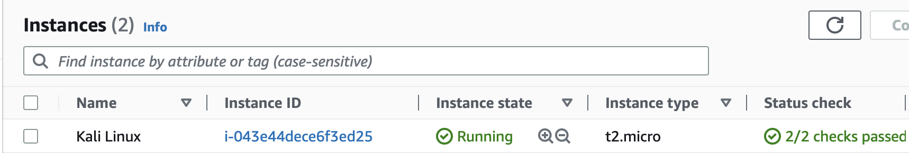
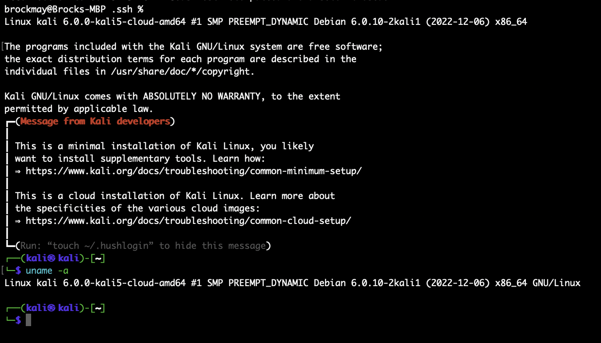

# IS 565 February Creation

## Team Members
- Brock May
- David Holdstock
- Josh Snyder
- Joseph Curtis
- Tucker Weibell

## Overview
This project essentially allows for anyone to get setup with an instance of Kali Linux in AWS pretty easily with just a few commands

**NOTE: USING THIS DEPLOYS RESOURCES THAT COST MONEY**

## Setup

### Creating an AWS Access Key

Before you can deploy resources to AWS, you will need to sign in to your aws account to create a access key

Instructions on how to do that can be found [here](https://docs.aws.amazon.com/IAM/latest/UserGuide/id_credentials_access-keys.html#Using_CreateAccessKey)

### Getting the repo

Next, you will need to clone this repo

### Signing in to the AWS Account

Now, go to the root of the directory that was just created after cloning the repo

Open a Terminal and enter these commands:
- `export AWS_ACCESS_KEY_ID=<Your access key id here>`
- `export AWS_SECRET_ACCESS_KEY=<Your access key here>`

### Installing Terraform
If Terraform is not installed, follow the installation instructions [here](https://developer.hashicorp.com/terraform/tutorials/aws-get-started/install-cli)

Otherwise, skip this step

## Time to use Terraform

### Initializing Terraform
This will establish the connection to your AWS account and create a few files needed for terraform to work
In the root directory, run `terraform init`.

### Terraform Plan
This command will tell you what resources will be created, changed or destroyed

In the same directory, run `terraform plan`.

### Terraform Apply
This command will now deploy the EC2 instance to AWS

In the same directory, run `terraform apply`.

You will likely notice that on the first run, you will see some errors about having to subscribe to use Kali Linux's software in the AWS Marketplace.

The error message will show a link where that can be done

Once you subscribe to Kali Linux on the AWS Marketplace, run `terraform apply` again

And within a few minutes, you will be able to have a working EC2 instance

You should now see something in your EC2 instances on your AWS Account

**NOTE: USING THIS COMMAND DEPLOYS RESOURCES THAT COST MONEY**

## Connecting to your EC2 Instance
To get the key pair needed to ssh into your ec2 instance, you will need to run the following command:

`terraform output -raw private_key`

Take the contents of what terraform spat out and create a file called
`Kali.pem`

Next, ssh into the EC2 instance using a command like this:

`ssh -i "Kali.pem" kali@ec2-ip-address-goes-here.us-west-2.compute.amazonaws.com`

For the ip address, use dashes instead of dots. Otherwise you may have a bad time.

You can find the exact command by going into AWS -> EC2 -> Click on the instance id of the instance you just created -> Connect -> SSH

## Woohoo!!!
If everything worked as expected, you should see the Kali Linux terminal

## Cleaning up
Since these resources cost money, it is probably good to clean up these resources.

To do so, run `terraform destroy` in the root directory

## Things to be aware of

Do not delete the terraform.tfstate file (or any other terraform files for that matter) because that is how terraform knows what resources it needs to destroy, create or change.

If those are deleted, then the resources will have to be cleaned up manually (which is the whole reason why terraform was made in the first place)